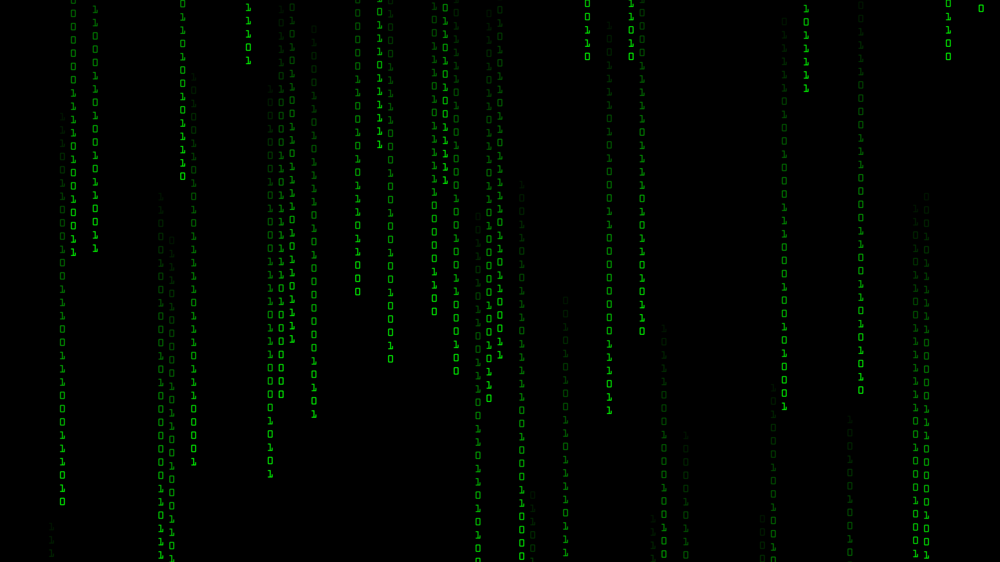

# Number Rain
Small application that creates a number rain inspired by the movie matrix.

<br/>

<p float="left">
   
</p>

<br/>

## Dependencies
The programm depends on the 2D graphics API [SFML2](https://www.sfml-dev.org/download.php), which has to be installed in order for the programm to work. \
To compile the programm, one can use the provided [Makefile](Makefile).

## Usage
The programm can be run with _four_ optional command line arguments, being _speed_, _trail length_, _character size_ and the _margin between characters_ in that order. The standard values are:
```
./NumberRain.exe 300 30 30 15 
```

